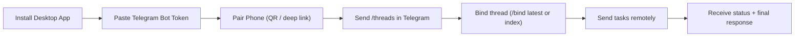
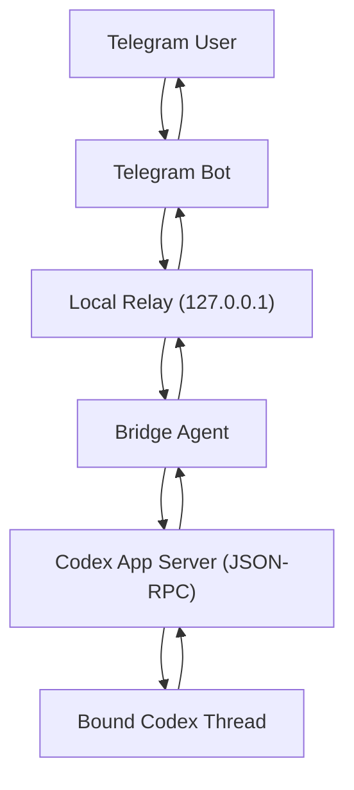

# Codex Bridge Desktop

[中文](#中文) | [English](#english)

## English

Remote-control your local Codex from Telegram, as if you never left your desk.

Codex Bridge Desktop turns Codex into a mobile-operable workflow: send tasks from your phone, bind to the exact thread you care about, review approvals, and get final responses back in Telegram.


### Why this exists

Codex is great on desktop, but real work does not stop when you step away.

This project solves exactly that:
- Continue Codex conversations from your phone.
- Keep thread-level control (`/threads`, `/bind`, `/current`) instead of a generic chat relay.
- Handle approvals remotely (`/approve`, `/deny`) with clear visibility.
- Check Codex usage quickly (`/usage`, `/limits`).

### What you can do today

- Bind Telegram to a specific Codex thread and run remote turns.
- Send text and image inputs from Telegram.
- See command/status/final response in the same Telegram chat.
- Use macOS menu bar for quick state and remote on/off.
- Run bilingual experience (English + Chinese) across desktop + Telegram responses.

### Experience flow



### Architecture (high level)



---

## Quick Start (2-3 minutes)

### 1. Download and open
1. Download latest build from [Releases](https://github.com/tonyHu08/CodeX_Bridge/releases).
2. Open `Codex Bridge Desktop`.
3. Make sure Codex App is installed and logged in on this Mac.

### 2. Create your Telegram bot
1. Open `@BotFather` in Telegram.
2. Run `/newbot`.
3. Copy the Bot Token.

### 3. Pair desktop with phone
1. Paste Token in the desktop app and save.
2. Click pairing.
3. Open pairing link (or scan QR) in Telegram.

### 4. Bind a Codex thread
1. Send `/threads` in Telegram.
2. Pick one thread button or run `/bind latest`.
3. Send normal text to start remote execution.

### 5. Daily commands
- `/threads`
- `/bind latest`
- `/current`
- `/status`
- `/usage` (alias: `/limits`)
- `/cancel`
- `/unbind`

---

## Developer Guide

### Monorepo layout
- `apps/desktop`: Electron + React desktop app (onboarding + app home + menu bar).
- `packages/bridge-core`: orchestration, Codex client, approvals, persistence.
- `services/cloud-relay`: optional self-hosted relay.
- `src` (legacy): earlier implementation kept for compatibility.

### Local development
```bash
cd /path/to/codex-remote-bridge
npm install
npm run setup
npm run dev:relay
npm run build:desktop
npm run start:desktop
```

### Quality checks
```bash
npm run typecheck
npm run build
```

### Environment variables
- `HOST` (default `127.0.0.1`)
- `PORT` (default `8787`)
- `RELAY_PUBLIC_BASE_URL` (default `http://127.0.0.1:8787`)
- `RELAY_BOT_USERNAME`
- `TELEGRAM_BOT_TOKEN`
- `BRIDGE_LOCALE` (`en` or `zh`)

### More docs
- [Configuration](./docs/CONFIG.md)
- [Commands](./docs/COMMANDS.md)
- [Architecture](./docs/ARCHITECTURE.md)
- [Operations](./docs/OPERATIONS.md)
- [Troubleshooting](./docs/TROUBLESHOOTING.md)
- [Privacy](./docs/PRIVACY.md)
- [Self-hosting](./docs/SELF_HOSTING.md)
- [Threat model](./docs/THREAT_MODEL.md)

---

## 中文

用 Telegram 远程操控本机 Codex，让你离开电脑也能持续推进对话和任务。

### 这个项目能解决什么问题
- 人不在电脑前，Codex 对话就中断。
- 手机端缺少 thread 级别控制（不仅仅是“转发消息”）。
- 远程审批、查看状态、查看用量缺少统一入口。

Codex Bridge Desktop 提供“桌面 + Telegram”一体化远程体验：  
线程可绑定、状态可追踪、审批可确认、结果可回包。

### 已支持能力
- Telegram 文本/图片输入转发到绑定 thread。
- `/threads` 查看最近线程并绑定。
- `/approve` `/deny` 远程审批。
- `/usage` `/limits` 查询用量。
- 菜单栏快速查看在线状态与远程开关。
- 桌面端与 Telegram 均支持中英文。

### 快速上手
1. 在 [Releases](https://github.com/tonyHu08/CodeX_Bridge/releases) 下载桌面端并打开。  
2. 在 `@BotFather` 创建机器人并拿到 Token。  
3. 在桌面端保存 Token 并完成配对。  
4. Telegram 发送 `/threads` 后绑定线程。  
5. 直接发送消息开始远程操作。

### 常用命令
- `/threads`：列出最近线程
- `/bind latest`：绑定最新线程
- `/bind <编号|threadId>`：绑定指定线程
- `/current`：查看当前 thread 快照
- `/status`：查看当前状态
- `/usage`：查看 Codex 用量
- `/cancel`：终止当前任务
- `/unbind`：解绑线程
