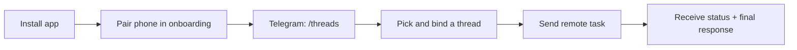
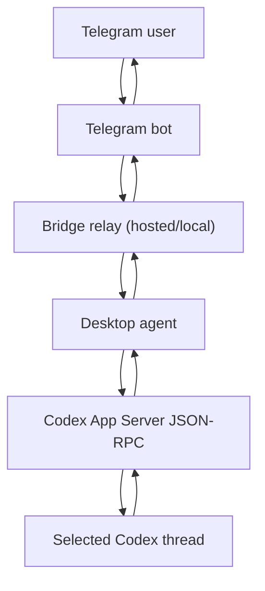

# Codex Bridge Desktop

[English](#english) | [中文](#中文)

## English

Control your local Codex threads from Telegram in under 2 minutes.

Codex Bridge is built for the exact pain point many people hit today: Codex is powerful on desktop, but your work stalls the moment you step away from your machine. This project keeps your real Codex thread alive on your phone, with status, approvals, and results in one chat.


### Why people star this project

- No CLI in the main path.
- Remote control is thread-aware (`/threads`, `/bind`, `/current`).
- Safe remote execution with approval commands (`/approve`, `/deny`).
- Menu bar quick controls for online state and remote switch.
- Built-in bilingual UX (English + Chinese).

### What you can do

- Send text or image input from Telegram to the bound Codex thread.
- Watch execution state + final response in the same Telegram chat.
- Query Codex limits with `/usage` (alias: `/limits`).
- Cancel long runs with `/cancel`.
- Run official hosted mode (recommended) or switch to self-hosted mode.

### 2-minute setup (official hosted path)

1. Download the latest desktop build from [Releases](https://github.com/tonyHu08/CodeX_Bridge/releases).
2. Open the app and finish the 3-step onboarding:
   1. Codex environment check.
   2. Phone pairing (QR / deep link).
   3. In Telegram, send `/threads` and bind one thread.
3. Send your first remote message directly in Telegram.

No BotFather token is required in official hosted mode.

### Command cheat sheet

- `/threads` list recent threads and bind quickly.
- `/bind latest` bind latest thread.
- `/bind <index|threadId>` bind target thread.
- `/current` show snapshot of current bound thread.
- `/status` show bridge status.
- `/usage` or `/limits` show Codex limits.
- `/cancel` stop running task.
- `/unbind` clear current binding.

### Visual flow



### Architecture



### Screenshots and media


- [Press kit](./assets/press-kit/README.md)
- [Launch playbook](./docs/LAUNCH_PLAYBOOK.md)
- [User stories](./docs/USER_STORIES.md)

### Docs

- [Commands](./docs/COMMANDS.md)
- [Configuration](./docs/CONFIG.md)
- [Architecture details](./docs/ARCHITECTURE.md)
- [Operations](./docs/OPERATIONS.md)
- [Relay API](./docs/API.md)
- [Privacy](./docs/PRIVACY.md)
- [Threat model](./docs/THREAT_MODEL.md)
- [Self-hosting](./docs/SELF_HOSTING.md)
- [Troubleshooting](./docs/TROUBLESHOOTING.md)

### Development

```bash
npm install
npm run setup
npm run dev:relay
npm run build:desktop
npm run start:desktop
```

```bash
npm run typecheck
npm run build
```

---

## 中文

把本机 Codex 远程装进 Telegram，2 分钟内就能发出第一条远程指令。

Codex Bridge 解决的是一个非常实际的问题：你离开电脑后，Codex 对话就中断。这个项目让你在手机上继续操作同一个 thread，保持上下文、审批和结果回包的一致性。

### 核心价值

- 主路径不依赖命令行。
- 不是普通“消息转发”，而是 thread 级远程控制。
- 支持远程审批和状态追踪。
- 菜单栏可直接查看状态、开关远程。
- 桌面端和 Telegram 双语体验（中/英）。

### 已支持能力

- Telegram 文本/图片输入转发到绑定 thread。
- `/threads` 查看并快速绑定会话。
- `/usage` / `/limits` 查看 Codex 用量。
- `/cancel` 终止长任务。
- 官方托管模式（推荐）与本地自托管模式可切换。

### 快速开始（官方托管）

1. 在 [Releases](https://github.com/tonyHu08/CodeX_Bridge/releases) 下载并打开桌面 App。
2. 按向导完成三步：
   1. Codex 环境检测。
   2. 手机配对（扫码或 deep link）。
   3. Telegram 发送 `/threads` 并绑定线程。
3. 直接在 Telegram 发送消息开始远程操作。

说明：官方托管模式下，不需要手动去 BotFather 创建 Token。

### 常用命令

- `/threads`：查看最近线程并快速绑定
- `/bind latest`：绑定最新线程
- `/bind <编号|threadId>`：绑定指定线程
- `/current`：查看当前线程快照
- `/status`：查看桥接状态
- `/usage` 或 `/limits`：查看用量
- `/cancel`：终止当前任务
- `/unbind`：解除当前绑定

### 相关文档

- [发布增长手册](./docs/LAUNCH_PLAYBOOK.md)
- [用户故事脚本](./docs/USER_STORIES.md)
- [媒体素材包](./assets/press-kit/README.md)
