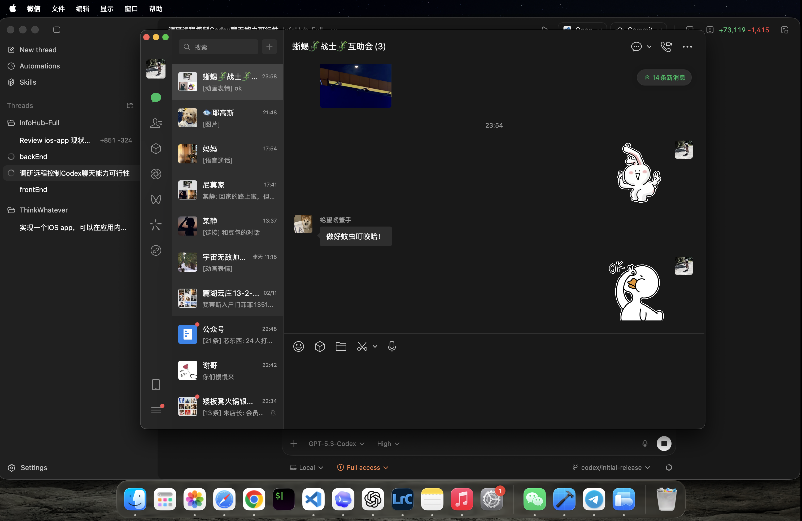
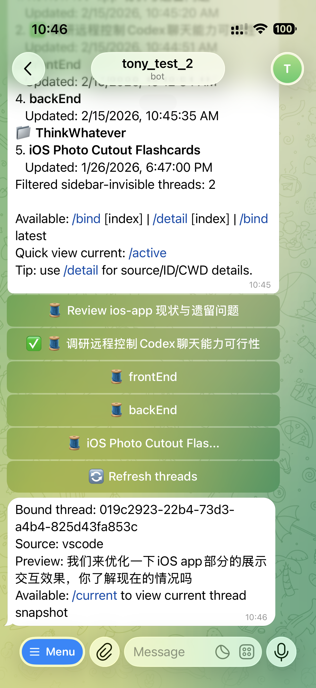
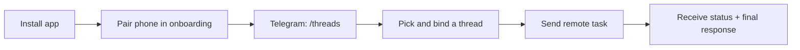
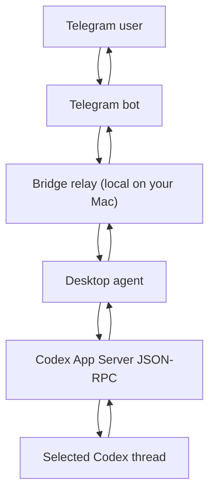

# CodeX Telegram

Control your local Codex threads from Telegram. Keep working while away from your Mac. 🚀


[English](#english) | [中文](#中文)

Quick links: [Download](https://github.com/tonyHu08/CodeX_Telegram/releases) · [Commands](./docs/COMMANDS.md) · [FAQ](./docs/FAQ.md) · [Troubleshooting](./docs/TROUBLESHOOTING.md) · [Press kit](./assets/press-kit/README.md) · [Report issue](https://github.com/tonyHu08/CodeX_Telegram/issues)

Latest: **v0.1.5** — `/current` stability patch (degrade-first snapshot), native Plan interaction path hardening, and full regression gate before release.

---

## English

### What is this?

Codex is great on desktop, but it is not remote-first: your work stalls the moment you step away from your machine.

**CodeX Telegram** keeps your real Codex thread alive on your phone, with:

- ✅ Thread-aware remote control (`/threads`, `/bind`, `/current`)
- 🔒 Safe remote execution (approvals: `/approve` / `/deny`)
- 📊 Status + limits (`/status`, `/usage`)
- 🧰 Menu bar controls (online state + remote switch)
- 🌏 Bilingual UX (English + Chinese)

### Real screenshots

| Desktop app home | Telegram remote control |
| --- | --- |
|  |  |

### Features ✨

- **Remote chat with context**: keep using the same local Codex thread from Telegram.
- **Approvals**: when Codex wants to run commands or change files, you can approve/deny from Telegram.
- **Queue + cancel**: long runs can be cancelled with `/cancel`.
- **Usage**: check your remaining limits with `/usage` (alias: `/limits`).
- **Native Plan mode with interaction**: toggle with `/plan on|off|status`, answer plan questions in Telegram buttons/text, then confirm `Execute / Refine / Cancel`.

Notes:

- Photo input is **experimental** and depends on your Codex App / App Server version.
- Per-thread “busy status” is **not** reliably observable from Codex today (we only know tasks started by this bridge).

### 2-minute setup (local mode, recommended for open-source)

1. Download the latest desktop build from [Releases](https://github.com/tonyHu08/CodeX_Telegram/releases) and open it.
2. In the onboarding wizard:
   1. **Environment check** (Codex CLI + App Server).
   2. **Configure Telegram bot** (paste a BotFather token).
   3. **Pair your phone** (QR / deep link).
3. In Telegram:
   1. Send `/threads`
   2. Tap a thread button (or `/bind <index>`)
4. Send your first remote prompt.

### Command cheat sheet 🧩

| Command | What it does |
| --- | --- |
| `/threads` | List recent threads and bind quickly |
| `/bind latest` | Bind the latest thread |
| `/bind <index>` | Bind by list index (from `/threads`) |
| `/bind <threadId>` | Bind by thread ID |
| `/current` | Show snapshot of the current bound thread |
| `/status` | Show bridge status |
| `/usage` / `/limits` | Show Codex rate limits remaining |
| `/plan on` | Enable native Plan mode |
| `/plan off` | Switch back to Code mode |
| `/plan status` | Show mode + pending plan questions + pending execution confirmation |
| `/cancel` | Cancel the current task |
| `/unbind` | Clear current binding |

### Recent stability fixes 🛠️

- `/threads` is now resilient: if `thread/list` is slow/unavailable, it degrades to the Codex sidebar cache so Telegram still gets a fast reply.
- `/current` is now degrade-first: if full `includeTurns` read is slow, it returns a fallback snapshot instead of failing hard.
- Reduced “stuck waiting” cases caused by Keychain prompts/hangs (best-effort Keychain access with short timeouts).

### Visual flow



### Architecture



### Docs

- [Commands](./docs/COMMANDS.md)
- [Configuration](./docs/CONFIG.md)
- [Architecture details](./docs/ARCHITECTURE.md)
- [Operations](./docs/OPERATIONS.md)
- [Relay API](./docs/API.md)
- [Privacy](./docs/PRIVACY.md)
- [Threat model](./docs/THREAT_MODEL.md)
- [Self-hosting](./docs/SELF_HOSTING.md)
- [Troubleshooting](./docs/TROUBLESHOOTING.md)
- [FAQ](./docs/FAQ.md)

### Help this project grow 💡

- Star the repo if it helped you.
- Share a screenshot or a short clip: pairing → `/threads` → first reply.
- If you write a post/video about it, open a PR to add it to the README.

### Development

```bash
npm install
npm run setup
npm run build
npm run start:desktop
```

---

## 中文

### 这是什么？

Codex 在桌面端很强，但它不是“随时随地继续工作”的工具：你一离开电脑，对话就中断。

**CodeX Telegram** 把你的本机 Codex thread 连接到 Telegram，让你在手机上继续推进同一条对话，上下文、审批和回包都保持一致：

- ✅ thread 级远程控制（`/threads`、`/bind`、`/current`）
- 🔒 远程审批（`/approve` / `/deny`）
- 📊 状态与用量（`/status`、`/usage`）
- 🧰 菜单栏快速开关（在线状态 + 远程开关）
- 🌏 双语体验（中 / 英）

### 真机截图

| 电脑端主页 | Telegram 远程控制 |
| --- | --- |
|  |  |

### 功能亮点 ✨

- **带上下文的远程续聊**：不是消息转发，是继续你本机的真实 thread。
- **审批**：需要执行命令/修改文件时，可在 Telegram 一键同意/拒绝。
- **队列与终止**：长任务可以用 `/cancel` 主动停止。
- **用量**：`/usage`（别名 `/limits`）查看剩余额度。
- **原生 Plan 模式（可交互）**：通过 `/plan on|off|status` 切换，并可在 Telegram 内回答计划问题，最终确认“执行 / 继续改 / 取消”。

说明：

- 图片输入属于**实验能力**，是否可用取决于你的 Codex App / App Server 版本。
- 每个 thread 的“是否正在运行”目前无法从 Codex 稳定获取（桥接只能知道自己触发的任务）。

### 2 分钟上手（开源推荐：本机模式）

1. 在 [Releases](https://github.com/tonyHu08/CodeX_Telegram/releases) 下载并打开桌面 App。
2. 按向导完成：
   1. **环境检测**（Codex CLI + App Server）
   2. **配置 Telegram 机器人**（粘贴 BotFather token）
   3. **手机配对**（扫码或 deep link）
3. Telegram 里：
   1. 发送 `/threads`
   2. 点选 thread（或 `/bind <编号>`）
4. 开始发消息远程操作。

### 常用命令 🧩

| 命令 | 作用 |
| --- | --- |
| `/threads` | 查看最近会话并快速绑定 |
| `/bind latest` | 绑定最新会话 |
| `/bind <编号>` | 按 `/threads` 列表编号绑定 |
| `/bind <threadId>` | 按 threadId 绑定 |
| `/current` | 查看当前会话快照 |
| `/status` | 查看桥接状态 |
| `/usage` / `/limits` | 查看剩余用量与重置时间 |
| `/plan on` | 开启原生 Plan 模式 |
| `/plan off` | 切回 Code 模式 |
| `/plan status` | 查看当前模式、待回答计划问题、待确认执行状态 |
| `/cancel` | 终止当前任务 |
| `/unbind` | 解除绑定 |

### 最近稳定性修复 🛠️

- `/threads` 更稳：`thread/list` 超时会降级到 Codex 侧边栏缓存，确保 Telegram 仍能快速拿到列表。
- `/current` 改为“降级优先”：`includeTurns` 读取慢时仍返回基础快照，不再直接红叉失败。
- 降低 Keychain 造成的“卡住/无回包”风险（Keychain 访问改为短超时 best-effort）。

### 相关文档

- [命令说明](./docs/COMMANDS.md)
- [故障排查](./docs/TROUBLESHOOTING.md)
- [隐私与边界](./docs/PRIVACY.md)
